<!--
GENERATED by the devcards gallery generator — DO NOT EDIT.
Regenerate: `clojure -M:bindings:run gallery` from the devcards tool root
(tools/devcards/). Sources: corpus/spec.edn (cards + notes) +
conventions/ui-render-conventions.edn (:widget-states, :state-selectors) +
output/json-descriptors/descriptor-set.json (props schema) + the colocated
contact-sheet JPEGs rendered from the pinned controls.wasm.
-->

# Widget gallery

Per-widget rendered doc pages, generated from the same corpus the devcard gates verify — all 22 `ui.WidgetType` values, enum-derived (an undeclared WidgetType fails generation). Previews are the asgard-dark contact sheet; each page adds vanilla + asgard-light.

| widget | committed states | preview (asgard dark) |
|---|---|---|
| [`WIDGET_OBJ`](./WIDGET_OBJ/README.md) | `default` | [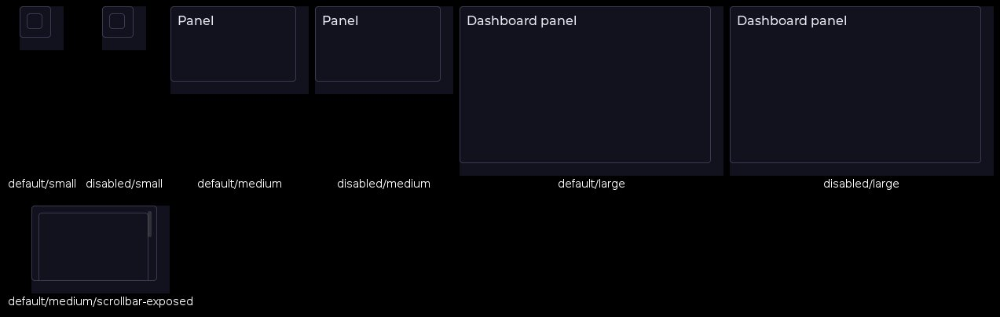](./WIDGET_OBJ/README.md) |
| [`WIDGET_BUTTON`](./WIDGET_BUTTON/README.md) | `default`, `hovered`, `pressed`, `checked`, `disabled`, `focus-key` | [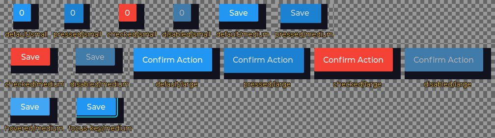](./WIDGET_BUTTON/README.md) |
| [`WIDGET_LABEL`](./WIDGET_LABEL/README.md) | `default` |  |
| [`WIDGET_SLIDER`](./WIDGET_SLIDER/README.md) | `default`, `hovered`, `pressed`, `disabled`, `focus-key`, `edited` | [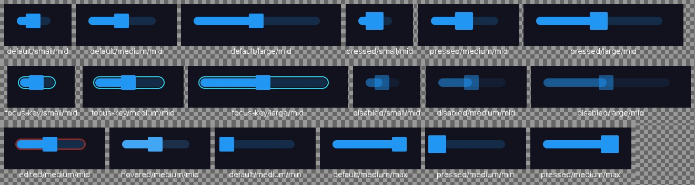](./WIDGET_SLIDER/README.md) |
| [`WIDGET_IMAGE`](./WIDGET_IMAGE/README.md) | `default` | [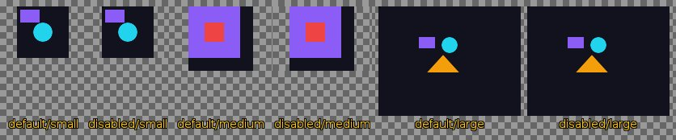](./WIDGET_IMAGE/README.md) |
| [`WIDGET_ARC`](./WIDGET_ARC/README.md) | `default`, `hovered`, `pressed`, `disabled` | [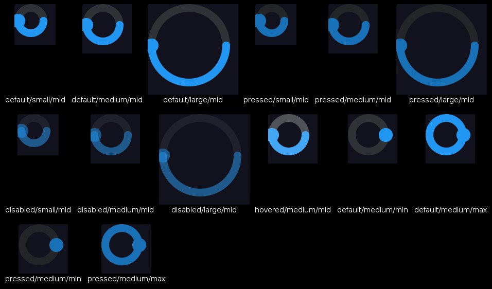](./WIDGET_ARC/README.md) |
| [`WIDGET_BAR`](./WIDGET_BAR/README.md) | `default`, `disabled`, `focus-key`, `edited` | [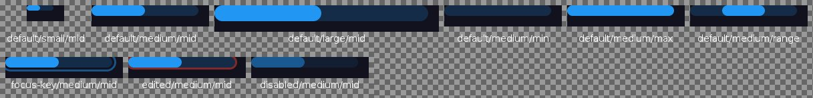](./WIDGET_BAR/README.md) |
| [`WIDGET_SWITCH`](./WIDGET_SWITCH/README.md) | `default`, `hovered`, `checked`, `disabled`, `focus-key` | [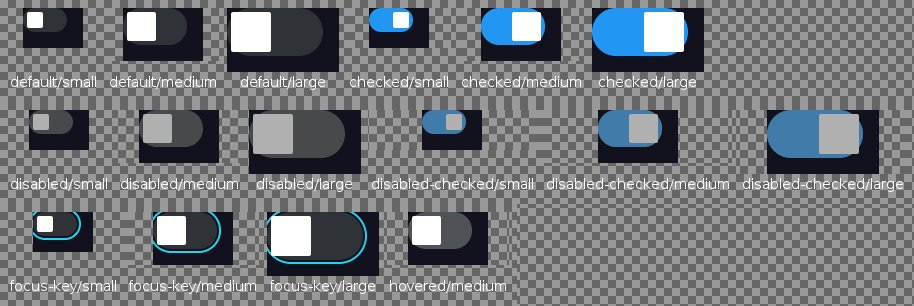](./WIDGET_SWITCH/README.md) |
| [`WIDGET_CHECKBOX`](./WIDGET_CHECKBOX/README.md) | `default`, `hovered`, `pressed`, `checked`, `disabled`, `focus-key` |  |
| [`WIDGET_DROPDOWN`](./WIDGET_DROPDOWN/README.md) | `default`, `hovered`, `pressed`, `disabled`, `focus-key` | [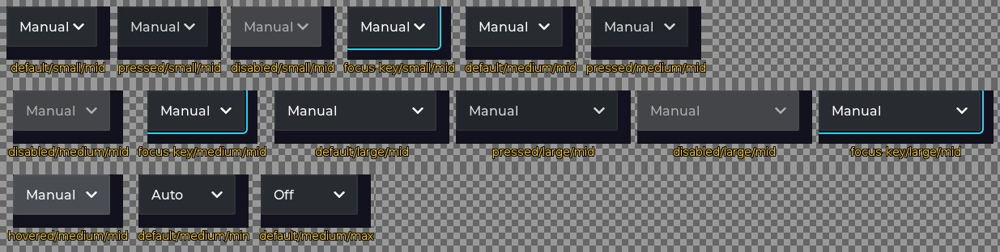](./WIDGET_DROPDOWN/README.md) |
| [`WIDGET_ROLLER`](./WIDGET_ROLLER/README.md) | `default`, `hovered`, `pressed`, `disabled`, `focus-key`, `edited` | [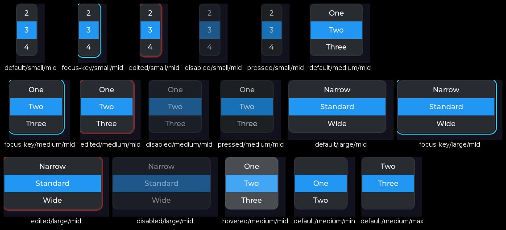](./WIDGET_ROLLER/README.md) |
| [`WIDGET_TEXTAREA`](./WIDGET_TEXTAREA/README.md) | `default`, `hovered`, `focused`, `focus-key`, `edited`, `disabled` | [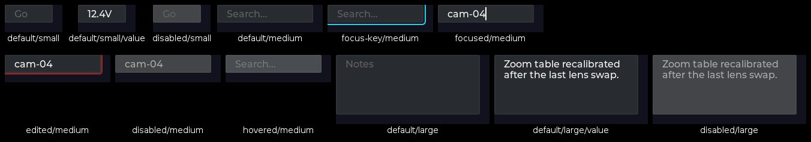](./WIDGET_TEXTAREA/README.md) |
| [`WIDGET_SPINBOX`](./WIDGET_SPINBOX/README.md) | `default`, `hovered`, `focus-key`, `edited`, `disabled` |  |
| [`WIDGET_SPINNER`](./WIDGET_SPINNER/README.md) | `default` | [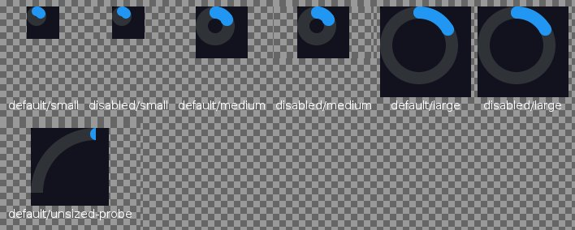](./WIDGET_SPINNER/README.md) |
| [`WIDGET_LED`](./WIDGET_LED/README.md) | `default` | [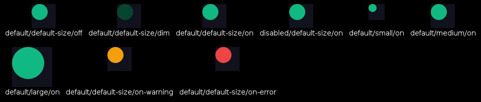](./WIDGET_LED/README.md) |
| [`WIDGET_LINE`](./WIDGET_LINE/README.md) | `default` |  |
| [`WIDGET_SCALE`](./WIDGET_SCALE/README.md) | `default` | [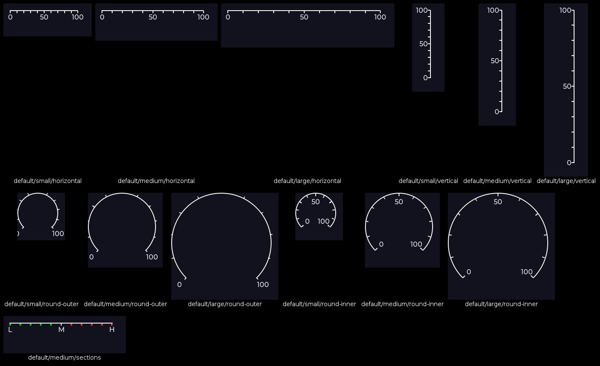](./WIDGET_SCALE/README.md) |
| [`WIDGET_BUTTONMATRIX`](./WIDGET_BUTTONMATRIX/README.md) | `default` | [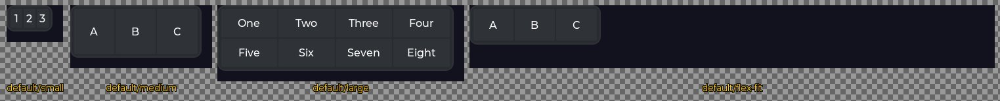](./WIDGET_BUTTONMATRIX/README.md) |
| [`WIDGET_TABLE`](./WIDGET_TABLE/README.md) | `default` | [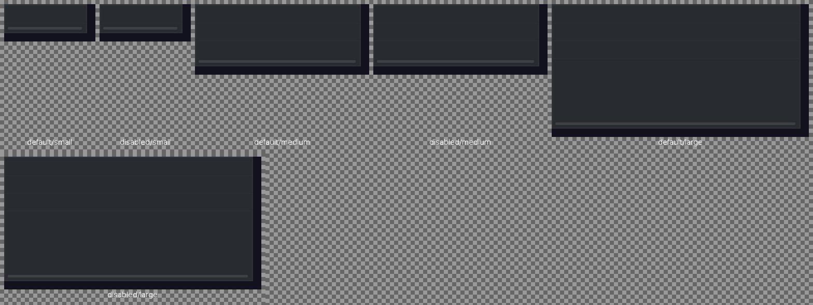](./WIDGET_TABLE/README.md) |
| [`WIDGET_TABVIEW`](./WIDGET_TABVIEW/README.md) | `default` | [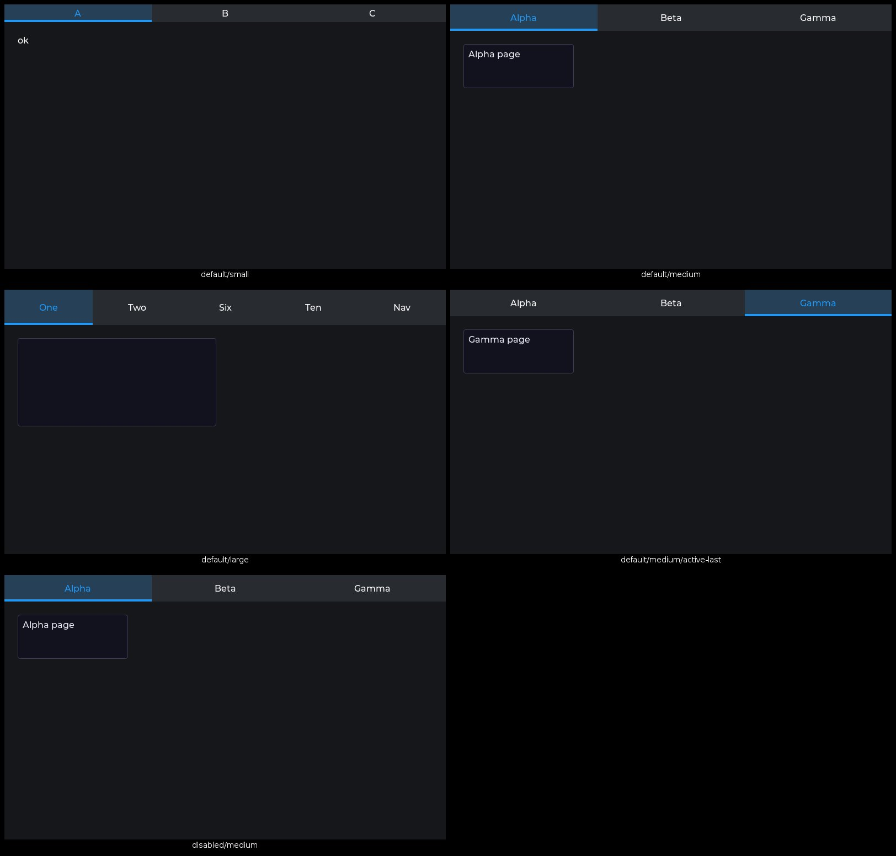](./WIDGET_TABVIEW/README.md) |
| [`WIDGET_CHART`](./WIDGET_CHART/README.md) | `default` | [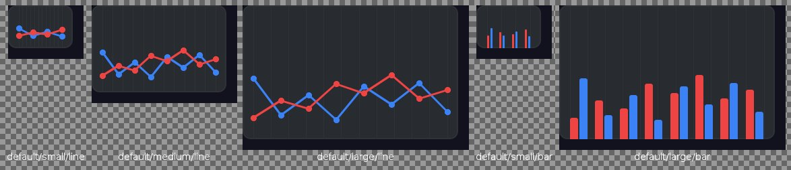](./WIDGET_CHART/README.md) |
| [`WIDGET_HOST_PROXY`](./WIDGET_HOST_PROXY/README.md) | `default` | [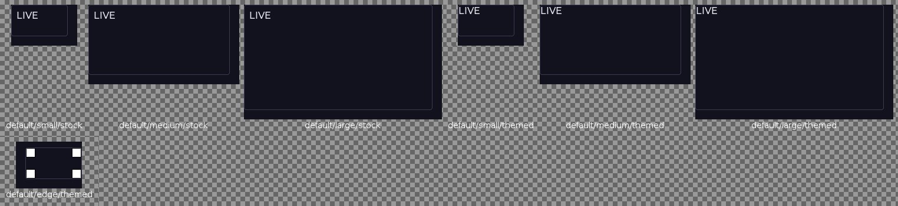](./WIDGET_HOST_PROXY/README.md) |

## Kitchen sinks

Six authored multi-widget compositions render on their own page: [kitchen sinks](./kitchen-sinks/README.md).

[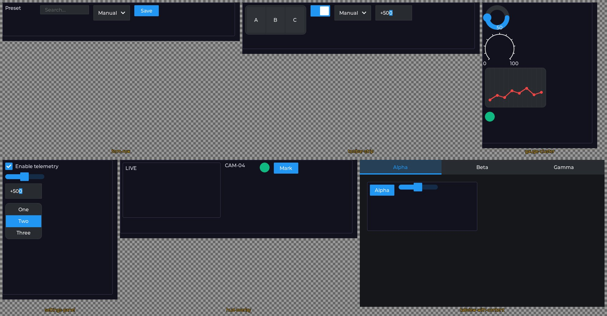](./kitchen-sinks/README.md)

## Composition legos

The authored-composition corpus — the public `devcards.legos` builders (media scrubber + foldable stage-manager dock) with their gate-held interaction contracts — renders on its own page: [composition legos](./legos/README.md).

[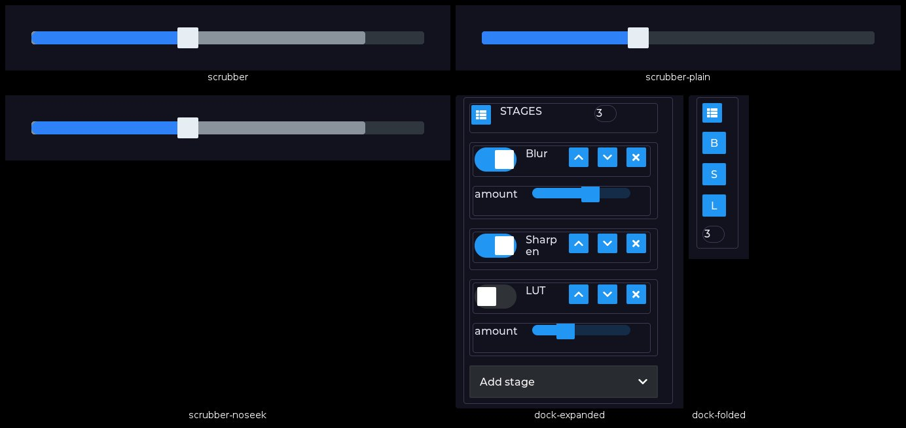](./legos/README.md)

## States legend

Sheet-cell labels are card-id tails (`<state>/<size>[/<value>]`); the state vocabulary below is a generated projection of `ui-render-conventions.edn` `:state-selectors` (the manifest is the one home).

| state | lv_state bit |
|---|---|
| `default` | 0 |
| `alt` | 1 |
| `checked` | 4 |
| `focused` | 8 |
| `focus-key` | 16 |
| `edited` | 32 |
| `hovered` | 64 |
| `pressed` | 128 |
| `scrolled` | 256 |
| `disabled` | 512 |
| `user-1` | 4096 |
| `user-2` | 8192 |
| `user-3` | 16384 |
| `user-4` | 32768 |
| `any` | 65535 |
