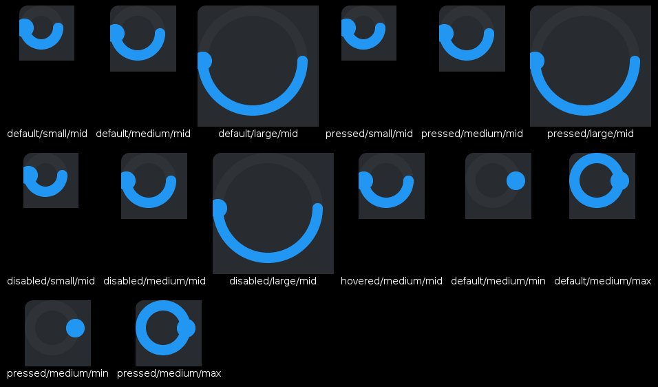
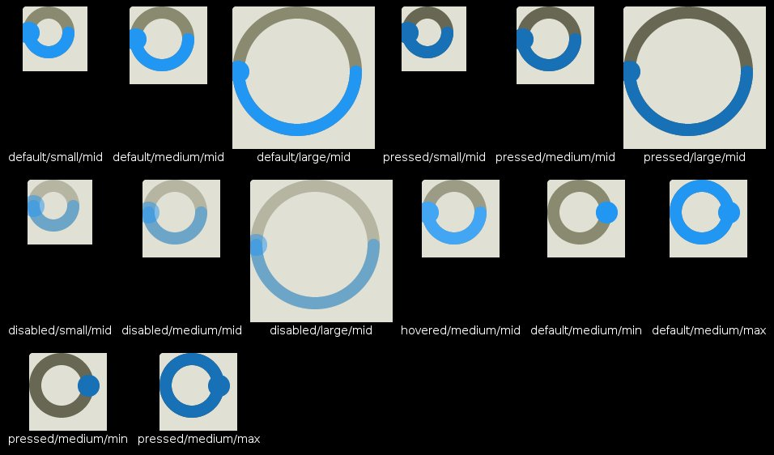

<!--
GENERATED by the devcards gallery generator — DO NOT EDIT.
Regenerate: `clojure -M:bindings:run gallery` from the devcards tool root
(tools/devcards/). Sources: corpus/spec.edn (cards + notes) +
conventions/ui-render-conventions.edn (:widget-states, :state-selectors) +
output/json-descriptors/descriptor-set.json (props schema) + the colocated
contact-sheet JPEGs rendered from the pinned controls.wasm.
-->

# WIDGET_ARC

`lv_arc` — 14 atomic corpus cards (state × size[/value], ids `lv_arc/<state>/<size>[/<value>]`), rendered unstyled so everything unset falls through to the loaded theme — the object under test. Cell labels are the card-id tails; cells are cropped to the card's dump_tree content box.

## Contact sheets

### vanilla (family 1, dark)

### asgard dark (family 0)

### asgard light (family 0)

## Committed states

The asgard theme commits to rendering each state below **visually distinct** from `default` (gate-held: distinctness). Any state *not* listed renders identical to `default` (inertness — hovered-on-a-label is the canonical probe).

- `default`
- `hovered`
- `pressed`
- `disabled`

## Props schema — `ArcProps` (`ui.ArcProps`)

| field | number | type | constraints |
|---|---|---|---|
| start_angle | 1 | uint32 | uint32.lte=360 |
| end_angle | 2 | uint32 | uint32.lte=360 |
| bg_start_angle | 3 | uint32 | uint32.lte=360 |
| bg_end_angle | 4 | uint32 | uint32.lte=360 |
| rotation | 5 | int32 | — |
| mode | 6 | enum ui.ArcMode | enum.definedOnly=true |
| min_value | 7 | int32 | — |
| max_value | 8 | int32 | — |
| value | 9 | int32 | — |

*Shape-only: the committed JSON descriptor carries no `SourceCodeInfo` comments and `docs/.protodoc/proto-db.edn` does not cover the `ui` package, so no per-field prose exists to include (protogen backlog).*

## Known limitations

checked N/A (continuous-value drag input, no CHECKED selector in the stock arm). Stock adds no pressed style for arc — pressed cells pin geometry-survives-state; distinctness under the asgard theme is the manifest's commitment.

---
Cross-links: [`ui_ast.proto`](../../../proto/ui/ui_ast.proto) &middot; [protodoc index](../../index.md) &middot; [widget gallery index](../README.md)
