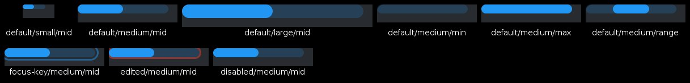
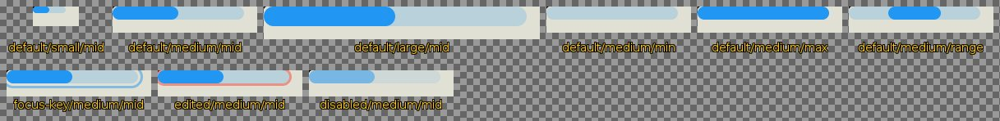

<!--
GENERATED by the devcards gallery generator — DO NOT EDIT.
Regenerate: `clojure -M:bindings:run gallery` from the devcards tool root
(tools/devcards/). Sources: corpus/spec.edn (cards + notes) +
conventions/ui-render-conventions.edn (:widget-states, :state-selectors) +
output/json-descriptors/descriptor-set.json (props schema) + the colocated
contact-sheet JPEGs rendered from the pinned controls.wasm.
-->

# WIDGET_BAR

`lv_bar` — 9 atomic corpus cards (state × size[/value], ids `lv_bar/<state>/<size>[/<value>]`), rendered unstyled so everything unset falls through to the loaded theme — the object under test. Cell labels are the card-id tails; cells are cropped to the card's dump_tree content box.

## Contact sheets

### vanilla (family 1, dark)

### asgard dark (family 0)

### asgard light (family 0)

## Committed states

The asgard theme commits to rendering each state below **visually distinct** from `default` (gate-held: distinctness). Any state *not* listed renders identical to `default` (inertness — hovered-on-a-label is the canonical probe).

- `default`
- `disabled`
- `focus-key`
- `edited`

## Props schema — `BarProps` (`ui.BarProps`)

| field | number | type | constraints |
|---|---|---|---|
| min_value | 1 | int32 | — |
| max_value | 2 | int32 | — |
| value | 3 | int32 | — |
| start_value | 4 | int32 | — |
| mode | 5 | enum ui.BarMode | enum.definedOnly=true |

*Shape-only: the committed JSON descriptor carries no `SourceCodeInfo` comments and `docs/.protodoc/proto-db.edn` does not cover the `ui` package, so no per-field prose exists to include (protogen backlog).*

## Known limitations

Declared as '9 cards in one composite gallery'; atomized here (one card per cell) — same 9 cells. Stock draws outline_primary/secondary on focus-key/edited, so the conventions manifest commits WIDGET_BAR to [:default :disabled :focus-key :edited] and those cells render visually distinct under the asgard theme.

---
Cross-links: [`ui_ast.proto`](../../../proto/ui/ui_ast.proto) &middot; [protodoc index](../../index.md) &middot; [widget gallery index](../README.md)
