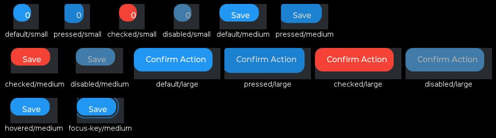
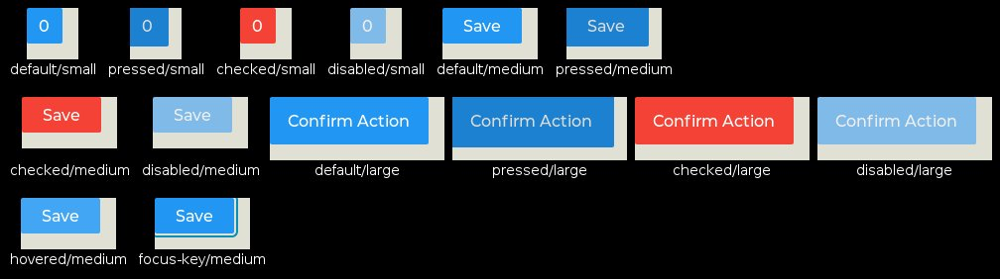

<!--
GENERATED by the devcards gallery generator — DO NOT EDIT.
Regenerate: `clojure -M:bindings:run gallery` from the devcards tool root
(tools/devcards/). Sources: corpus/spec.edn (cards + notes) +
conventions/ui-render-conventions.edn (:widget-states, :state-selectors) +
output/json-descriptors/descriptor-set.json (props schema) + the colocated
contact-sheet JPEGs rendered from the pinned controls.wasm.
-->

# WIDGET_BUTTON

`lv_button` — 14 atomic corpus cards (state × size[/value], ids `lv_button/<state>/<size>[/<value>]`), rendered unstyled so everything unset falls through to the loaded theme — the object under test. Cell labels are the card-id tails; cells are cropped to the card's dump_tree content box.

## Contact sheets

### vanilla (family 1, dark)

### asgard dark (family 0)

### asgard light (family 0)

## Committed states

The asgard theme commits to rendering each state below **visually distinct** from `default` (gate-held: distinctness). Any state *not* listed renders identical to `default` (inertness — hovered-on-a-label is the canonical probe).

- `default`
- `hovered`
- `pressed`
- `checked`
- `disabled`
- `focus-key`

## Props schema — `ButtonProps` (`ui.ButtonProps`)

`ui.ButtonProps` carries **no widget-specific properties** — this widget draws entirely from the shared `WidgetNode` contract (`text`, `children`, `style_groups`, `states`).

*Shape-only: the committed JSON descriptor carries no `SourceCodeInfo` comments and `docs/.protodoc/proto-db.edn` does not cover the `ui` package, so no per-field prose exists to include (protogen backlog).*

## Known limitations

Every button carries an explicit child WIDGET_LABEL (builder law: renderer builds an EMPTY lv_button; text is a separate child). Label text held constant per size so state is the single variable.

---
Cross-links: [`ui_ast.proto`](../../../proto/ui/ui_ast.proto) &middot; [protodoc index](../../index.md) &middot; [widget gallery index](../README.md)
