<!--
GENERATED by the devcards gallery generator — DO NOT EDIT.
Regenerate: `clojure -M:bindings:run gallery` from the devcards tool root
(tools/devcards/). Sources: corpus/spec.edn (cards + notes) +
conventions/ui-render-conventions.edn (:widget-states, :state-selectors) +
output/json-descriptors/descriptor-set.json (props schema) + the colocated
per-card JPEGs rendered from the pinned controls.wasm.
-->

# WIDGET_CHECKBOX

`lv_checkbox` — 10 atomic corpus cards (state × size[/value], ids `lv_checkbox/<state>/<size>[/<value>]`), rendered unstyled so everything unset falls through to the loaded theme — the object under test. One image per card × family, cropped to the card's dump_tree content box; the row caption is the card-id tail.

## States

| state | vanilla (family 1, dark) | asgard dark (family 0) | asgard light (family 0) |
|---|---|---|---|
| `default/short` | 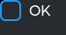 | 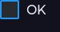 | 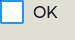 |
| `default/medium` | 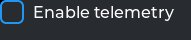 | 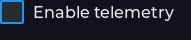 | 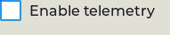 |
| `checked/medium` |  | 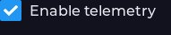 | 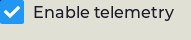 |
| `pressed/medium` | 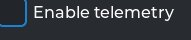 | 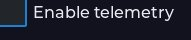 | 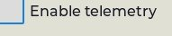 |
| `disabled/medium` | 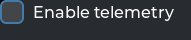 | 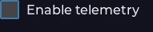 | 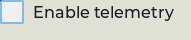 |
| `checked-disabled/medium` | 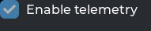 | 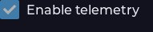 | 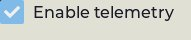 |
| `focus-key/medium` | 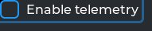 | 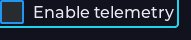 | 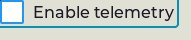 |
| `hovered/medium` |  | 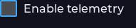 | 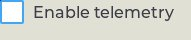 |
| `default/long-narrow` | 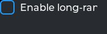 | 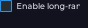 | 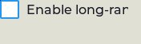 |
| `default/forced-narrow` | 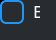 | 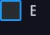 | 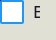 |

## Committed states

The asgard theme commits to rendering each state below **visually distinct** from `default` (gate-held: distinctness). Any state *not* listed renders identical to `default` (inertness — hovered-on-a-label is the canonical probe).

- `default`
- `hovered`
- `pressed`
- `checked`
- `disabled`
- `focus-key`

## Props schema — `CheckboxProps` (`ui.CheckboxProps`)

| field | number | type | constraints |
|---|---|---|---|
| checked | 1 | bool | — |

*Shape-only: the committed JSON descriptor carries no `SourceCodeInfo` comments and `docs/.protodoc/proto-db.edn` does not cover the `ui` package, so no per-field prose exists to include (protogen backlog).*

## Known limitations

lv_checkbox self-sizes (width_def/height_def both LV_SIZE_CONTENT); its size axis is label length, not w/h. CHECKED arrives via checkbox_props. DISP_LARGE note: the theme tier is recomputed from the live display resolution — this corpus's 800x480 canvas keeps greater_res>=720 so RADIUS_DEFAULT=12/DISP_LARGE is what renders (the survey flagged the 400x300 harness default as silently validating the WRONG tier).

---
Cross-links: [`ui_ast.proto`](../../../proto/ui/ui_ast.proto) &middot; [protodoc index](../../index.md) &middot; [widget gallery index](../README.md)
