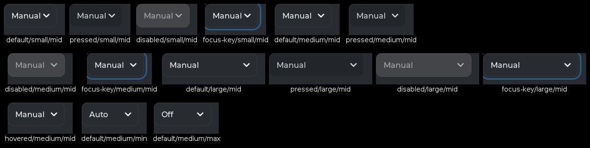
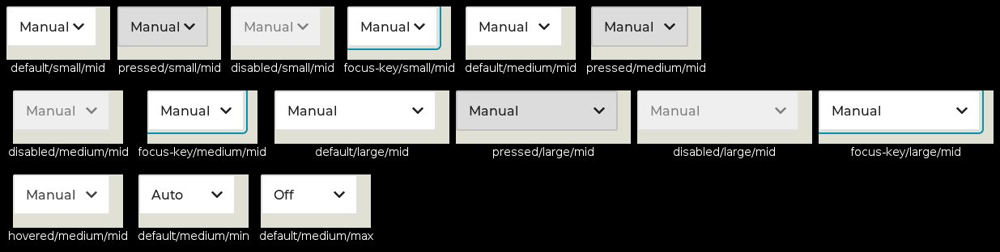

<!--
GENERATED by the devcards gallery generator — DO NOT EDIT.
Regenerate: `clojure -M:bindings:run gallery` from the devcards tool root
(tools/devcards/). Sources: corpus/spec.edn (cards + notes) +
conventions/ui-render-conventions.edn (:widget-states, :state-selectors) +
output/json-descriptors/descriptor-set.json (props schema) + the colocated
contact-sheet JPEGs rendered from the pinned controls.wasm.
-->

# WIDGET_DROPDOWN

`lv_dropdown` — 15 atomic corpus cards (state × size[/value], ids `lv_dropdown/<state>/<size>[/<value>]`), rendered unstyled so everything unset falls through to the loaded theme — the object under test. Cell labels are the card-id tails; cells are cropped to the card's dump_tree content box.

## Contact sheets

### vanilla (family 1, dark)

### asgard dark (family 0)

### asgard light (family 0)

## Committed states

The asgard theme commits to rendering each state below **visually distinct** from `default` (gate-held: distinctness). Any state *not* listed renders identical to `default` (inertness — hovered-on-a-label is the canonical probe).

- `default`
- `hovered`
- `pressed`
- `disabled`
- `focus-key`

## Props schema — `DropdownProps` (`ui.DropdownProps`)

| field | number | type | constraints |
|---|---|---|---|
| options | 1 | string | string.maxLen=1023 |
| selected | 2 | uint32 | — |
| direction | 3 | enum ui.Dir | enum.definedOnly=true |
| option_values | 4 | repeated int32 | repeated.maxItems=16 |

*Shape-only: the committed JSON descriptor carries no `SourceCodeInfo` comments and `docs/.protodoc/proto-db.edn` does not cover the `ui` package, so no per-field prose exists to include (protogen backlog).*

## Known limitations

Height left to content-fit sizing on purpose (an explicit h would hide a real text_clipped regression behind a generous box). The popup LIST is a separate LVGL class with no cell here — out of the survey's scope, recorded so it isn't silently dropped from a future gallery.

---
Cross-links: [`ui_ast.proto`](../../../proto/ui/ui_ast.proto) &middot; [protodoc index](../../index.md) &middot; [widget gallery index](../README.md)
