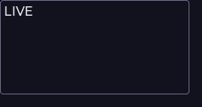
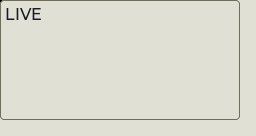
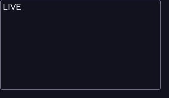
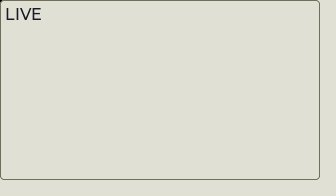
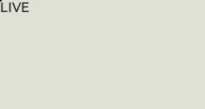
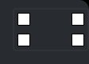
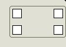

<!--
GENERATED by the devcards gallery generator — DO NOT EDIT.
Regenerate: `clojure -M:bindings:run gallery` from the devcards tool root
(tools/devcards/). Sources: corpus/spec.edn (cards + notes) +
conventions/ui-render-conventions.edn (:widget-states, :state-selectors) +
output/json-descriptors/descriptor-set.json (props schema) + the colocated
per-card JPEGs rendered from the pinned controls.wasm.
-->

# WIDGET_HOST_PROXY

`lv_host_proxy` — 5 atomic corpus cards (state × size[/value], ids `lv_host_proxy/<state>/<size>[/<value>]`), rendered unstyled so everything unset falls through to the loaded theme — the object under test. One image per card × family, cropped to the card's dump_tree content box; the row caption is the card-id tail.

## States

| state | vanilla (family 1, dark) | asgard dark (family 0) | asgard light (family 0) |
|---|---|---|---|
| `default/small` |  |  |  |
| `default/medium` |  |  |  |
| `default/large` |  |  |  |
| `default/medium/authored` |  |  |  |
| `default/edge` |  |  |  |

## Committed states

The asgard theme commits to rendering each state below **visually distinct** from `default` (gate-held: distinctness). Any state *not* listed renders identical to `default` (inertness — hovered-on-a-label is the canonical probe).

- `default`

## Props schema — `HostProxyProps` (`ui.HostProxyProps`)

| field | number | type | constraints |
|---|---|---|---|
| proxy_id | 1 | string | string.minLen=1, string.maxLen=63 |
| mode | 2 | enum ui.ProxyMode | enum.definedOnly=true |
| min_w | 3 | int32 | — |
| min_h | 4 | int32 | — |
| max_w | 5 | int32 | — |
| max_h | 6 | int32 | — |
| handle_size | 7 | uint32 | — |
| z | 8 | int32 | — |

*Shape-only: the committed JSON descriptor carries no `SourceCodeInfo` comments and `docs/.protodoc/proto-db.edn` does not cover the `ui` package, so no per-field prose exists to include (protogen backlog).*

## Known limitations

No LVGL state axis (falls through the generic lv_obj card arm; no state styles attach). apply_host_proxy now OWNS the default look in C: transparent fill, control-tier pad, panel-tier radius, with the BORDER left to the active theme (edge tone per family/mode) — the former stock/themed preview axis retired with it (the previews stood in for this default in radius + edge border; the shipped pad is the control-tier 4, not the previews' 0). Affordance children (glass/handles/cells) are theme-immune by construction. proxy_id 'px' is a placeholder id per the corpus secret-scan.

---
Cross-links: [`ui_ast.proto`](../../../proto/ui/ui_ast.proto) &middot; [protodoc index](../../index.md) &middot; [widget gallery index](../README.md)
