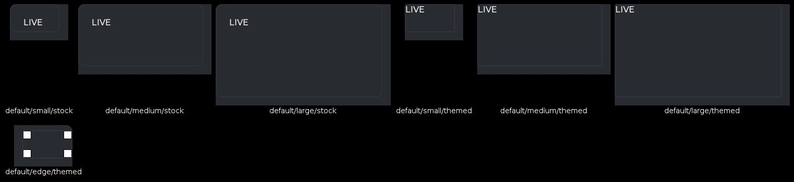
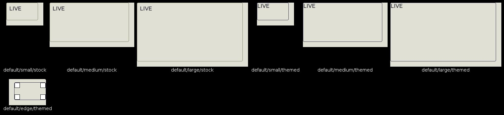

<!--
GENERATED by the devcards gallery generator — DO NOT EDIT.
Regenerate: `clojure -M:bindings:run gallery` from the devcards tool root
(tools/devcards/). Sources: corpus/spec.edn (cards + notes) +
conventions/ui-render-conventions.edn (:widget-states, :state-selectors) +
output/json-descriptors/descriptor-set.json (props schema) + the colocated
contact-sheet JPEGs rendered from the pinned controls.wasm.
-->

# WIDGET_HOST_PROXY

`lv_host_proxy` — 7 atomic corpus cards (state × size[/value], ids `lv_host_proxy/<state>/<size>[/<value>]`), rendered unstyled so everything unset falls through to the loaded theme — the object under test. Cell labels are the card-id tails; cells are cropped to the card's dump_tree content box.

## Contact sheets

### vanilla (family 1, dark)

### asgard dark (family 0)

### asgard light (family 0)

## Committed states

The asgard theme commits to rendering each state below **visually distinct** from `default` (gate-held: distinctness). Any state *not* listed renders identical to `default` (inertness — hovered-on-a-label is the canonical probe).

- `default`

## Props schema — `HostProxyProps` (`ui.HostProxyProps`)

| field | number | type | constraints |
|---|---|---|---|
| proxy_id | 1 | string | string.minLen=1, string.maxLen=63 |
| mode | 2 | enum ui.ProxyMode | enum.definedOnly=true |
| min_w | 3 | int32 | — |
| min_h | 4 | int32 | — |
| max_w | 5 | int32 | — |
| max_h | 6 | int32 | — |
| handle_size | 7 | uint32 | — |
| z | 8 | int32 | — |

*Shape-only: the committed JSON descriptor carries no `SourceCodeInfo` comments and `docs/.protodoc/proto-db.edn` does not cover the `ui` package, so no per-field prose exists to include (protogen backlog).*

## Known limitations

No LVGL state axis (falls through the generic lv_obj card arm; no state styles attach). The stock/themed variant pair IS this widget's axis: stock = the true unstyled fallthrough; themed = the survey's four proposed per-node raw props (radius 4 / border-width 1 / border-color #3A3A52 [edge-0, dark-resolved] / pad-all 0) standing in for the prospective C-side apply_host_proxy default. Affordance children (glass/handles/cells) are theme-immune by construction. proxy_id 'px' is a placeholder id per the corpus secret-scan.

---
Cross-links: [`ui_ast.proto`](../../../proto/ui/ui_ast.proto) &middot; [protodoc index](../../index.md) &middot; [widget gallery index](../README.md)
