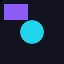
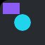
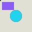
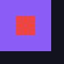
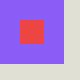
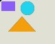

<!--
GENERATED by the devcards gallery generator — DO NOT EDIT.
Regenerate: `clojure -M:bindings:run gallery` from the devcards tool root
(tools/devcards/). Sources: corpus/spec.edn (cards + notes) +
conventions/ui-render-conventions.edn (:widget-states, :state-selectors) +
output/json-descriptors/descriptor-set.json (props schema) + the colocated
per-card JPEGs rendered from the pinned controls.wasm.
-->

# WIDGET_IMAGE

`lv_image` — 6 atomic corpus cards (state × size[/value], ids `lv_image/<state>/<size>[/<value>]`), rendered unstyled so everything unset falls through to the loaded theme — the object under test. One image per card × family, cropped to the card's dump_tree content box; the row caption is the card-id tail.

## States

| state | vanilla (family 1, dark) | asgard dark (family 0) | asgard light (family 0) |
|---|---|---|---|
| `default/small` |  |  |  |
| `disabled/small` |  |  |  |
| `default/medium` |  |  |  |
| `disabled/medium` |  |  |  |
| `default/large` |  |  |  |
| `disabled/large` |  |  |  |

## Committed states

The asgard theme commits to rendering each state below **visually distinct** from `default` (gate-held: distinctness). Any state *not* listed renders identical to `default` (inertness — hovered-on-a-label is the canonical probe).

- `default`

## Props schema — `ImageProps` (`ui.ImageProps`)

| field | number | type | constraints |
|---|---|---|---|
| src | 1 | string | string.maxLen=255 |
| has_pivot | 2 | bool | — |
| pivot_x | 3 | int32 | — |
| pivot_y | 4 | int32 | — |
| rotation | 5 | int32 | — |

*Shape-only: the committed JSON descriptor carries no `SourceCodeInfo` comments and `docs/.protodoc/proto-db.edn` does not cover the `ui` package, so no per-field prose exists to include (protogen backlog).*

## Known limitations

No stock theme arm exists for lv_image; pressed/checked are omitted per survey (CLICKABLE stripped at construction, and no style would change anyway). The disabled cells are inertness parity pins. Explicit w/h always set so the box never depends on decoded asset metadata.

---
Cross-links: [`ui_ast.proto`](../../../../../proto/ui/ui_ast.proto) &middot; [protodoc index](../../../../../docs/index.md) &middot; [widget gallery index](../README.md)
