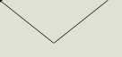

<!--
GENERATED by the devcards gallery generator — DO NOT EDIT.
Regenerate: `clojure -M:bindings:run gallery` from the devcards tool root
(tools/devcards/). Sources: corpus/spec.edn (cards + notes) +
conventions/ui-render-conventions.edn (:widget-states, :state-selectors) +
output/json-descriptors/descriptor-set.json (props schema) + the colocated
per-card JPEGs rendered from the pinned controls.wasm.
-->

# WIDGET_LINE

`lv_line` — 5 atomic corpus cards (state × size[/value], ids `lv_line/<state>/<size>[/<value>]`), rendered unstyled so everything unset falls through to the loaded theme — the object under test. One image per card × family, cropped to the card's dump_tree content box; the row caption is the card-id tail.

## States

| state | vanilla (family 1, dark) | asgard dark (family 0) | asgard light (family 0) |
|---|---|---|---|
| `default/small` |  |  |  |
| `default/medium` |  |  |  |
| `default/medium/y-invert` |  |  |  |
| `default/large` |  |  |  |
| `disabled/medium` |  |  |  |

## Committed states

The asgard theme commits to rendering each state below **visually distinct** from `default` (gate-held: distinctness). Any state *not* listed renders identical to `default` (inertness — hovered-on-a-label is the canonical probe).

- `default`

## Props schema — `LineProps` (`ui.LineProps`)

| field | number | type | constraints |
|---|---|---|---|
| points | 1 | repeated message ui.Point | — |
| y_invert | 2 | bool | — |

*Shape-only: the committed JSON descriptor carries no `SourceCodeInfo` comments and `docs/.protodoc/proto-db.edn` does not cover the `ui` package, so no per-field prose exists to include (protogen backlog).*

## Known limitations

Points reach LVGL through a per-screen pool, not the decoded node: lv_line_set_points KEEPS THE ARRAY BY POINTER and never copies it, so renderer.c's apply_line_points copies each point into line_point_pool (MAX_LINE_POINT_POOL slots of MAX_LINE_POINTS, reset per load) and hands LVGL that. Three things these cards exist to pin. FIRST, the wire field is a STATIC array (max_count:32), never FT_CALLBACK. Be precise about why, because the tempting story is wrong: this widget shipped drawing nothing because NO decode callback was ever installed and no apply arm existed — nanopb treats a null funcs.decode as 'success, but didn't do anything', so the points were dropped while the decode reported success. That is an omission. What the oneof DOES change is the repair: LineProps is a `oneof widget_props` arm, and nanopb zeroes a oneof submessage on arrival specifically to NULL any callback inside it, so retro-fitting a callback needs the `submsg_callback` option nothing here uses — which is why the static array is the fix rather than a callback. SECOND, a point-less line applies nothing and LVGL's own empty line stands, so a card that means to prove a LINE must carry points. Explicit finite w/h is still MANDATORY for this class, now for the ordinary reason rather than a vacuous one: LV_SIZE_CONTENT on a line sizes to the point extent, so a fixed box is what makes the three size cells comparable. THIRD, and this is the coverage fact worth carrying: the state-contract lane resolves a card's baseline by replacing the STATE segment of its id (gates.clj/baseline-id), so it relates cards across the STATE axis ONLY. Two cards differing on SIZE or on VARIANT are never compared to each other by any lane. That is how three lv_line sizes once carried one identical hash while the fourth card's :inert equality pin was satisfied by the very same emptiness — every lane was green and none of them could see it. The disabled cell is that inertness parity pin (stock has no line state arm), and it is meaningful only while the default cell it mirrors is itself non-empty.

---
Cross-links: [`ui_ast.proto`](../../../../../proto/ui/ui_ast.proto) &middot; [protodoc index](../../../../../docs/index.md) &middot; [widget gallery index](../README.md)
