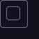
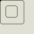
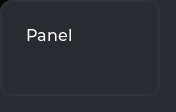
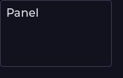
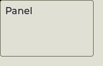
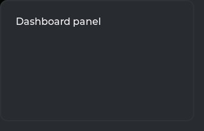
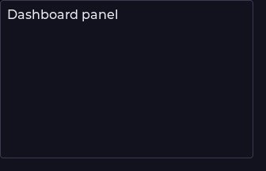
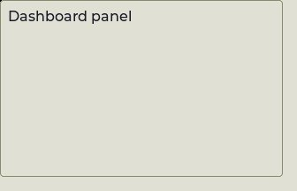
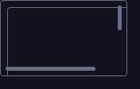
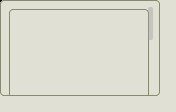

<!--
GENERATED by the devcards gallery generator — DO NOT EDIT.
Regenerate: `clojure -M:bindings:run gallery` from the devcards tool root
(tools/devcards/). Sources: corpus/spec.edn (cards + notes) +
conventions/ui-render-conventions.edn (:widget-states, :state-selectors) +
output/json-descriptors/descriptor-set.json (props schema) + the colocated
per-card JPEGs rendered from the pinned controls.wasm.
-->

# WIDGET_OBJ

`lv_obj` — 7 atomic corpus cards (state × size[/value], ids `lv_obj/<state>/<size>[/<value>]`), rendered unstyled so everything unset falls through to the loaded theme — the object under test. One image per card × family, cropped to the card's dump_tree content box; the row caption is the card-id tail.

## States

| state | vanilla (family 1, dark) | asgard dark (family 0) | asgard light (family 0) |
|---|---|---|---|
| `default/small` |  |  |  |
| `disabled/small` |  |  |  |
| `default/medium` |  |  |  |
| `disabled/medium` |  |  |  |
| `default/large` |  |  |  |
| `disabled/large` |  |  |  |
| `default/medium/scrollbar-exposed` |  |  |  |

## Committed states

The asgard theme commits to rendering each state below **visually distinct** from `default` (gate-held: distinctness). Any state *not* listed renders identical to `default` (inertness — hovered-on-a-label is the canonical probe).

- `default`

## Props schema — `ObjProps` (`ui.ObjProps`)

`ui.ObjProps` carries **no widget-specific properties** — this widget draws entirely from the shared `WidgetNode` contract (`text`, `children`, `style_groups`, `states`).

*Shape-only: the committed JSON descriptor carries no `SourceCodeInfo` comments and `docs/.protodoc/proto-db.edn` does not cover the `ui` package, so no per-field prose exists to include (protogen backlog).*

## Known limitations

WIDGET_OBJ is the renderer's default/fallback create case; a standalone lv_obj takes exactly the stock card+scrollbar fallthrough arm. The disabled cells are inertness parity pins: stock adds NO state style for plain lv_obj, so they MUST hash equal to their default twins.

---
Cross-links: [`ui_ast.proto`](../../../../../proto/ui/ui_ast.proto) &middot; [protodoc index](../../../../../docs/index.md) &middot; [widget gallery index](../README.md)
