<!--
GENERATED by the devcards gallery generator — DO NOT EDIT.
Regenerate: `clojure -M:bindings:run gallery` from the devcards tool root
(tools/devcards/). Sources: corpus/spec.edn (cards + notes) +
conventions/ui-render-conventions.edn (:widget-states, :state-selectors) +
output/json-descriptors/descriptor-set.json (props schema) + the colocated
per-card JPEGs rendered from the pinned controls.wasm.
-->

# WIDGET_SCALE

`lv_scale` — 13 atomic corpus cards (state × size[/value], ids `lv_scale/<state>/<size>[/<value>]`), rendered unstyled so everything unset falls through to the loaded theme — the object under test. One image per card × family, cropped to the card's dump_tree content box; the row caption is the card-id tail.

## States

| state | vanilla (family 1, dark) | asgard dark (family 0) | asgard light (family 0) |
|---|---|---|---|
| `default/small/horizontal` | 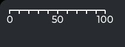 | 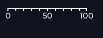 | 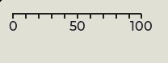 |
| `default/medium/horizontal` | 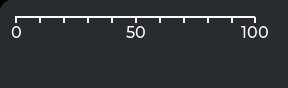 | 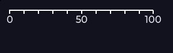 | 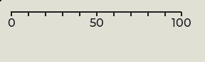 |
| `default/large/horizontal` | 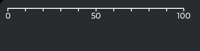 | 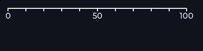 | 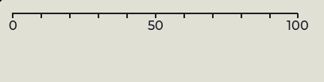 |
| `default/small/vertical` | 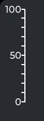 | 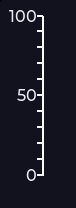 | 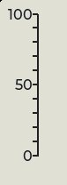 |
| `default/medium/vertical` | 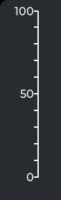 | 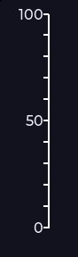 | 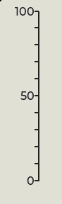 |
| `default/large/vertical` | 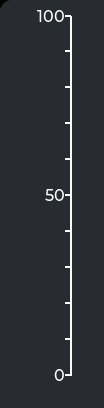 | 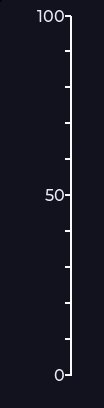 | 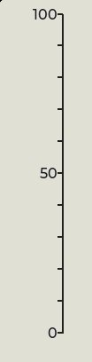 |
| `default/small/round-outer` | 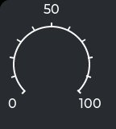 | 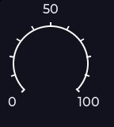 | 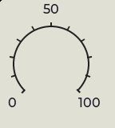 |
| `default/medium/round-outer` | 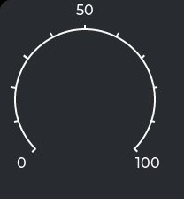 | 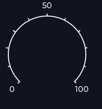 | 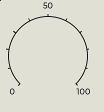 |
| `default/large/round-outer` | 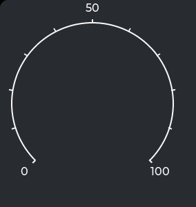 | 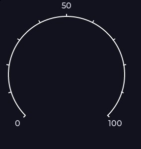 | 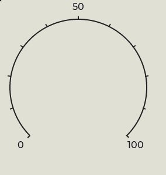 |
| `default/small/round-inner` | 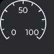 | 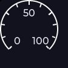 | 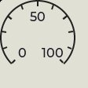 |
| `default/medium/round-inner` | 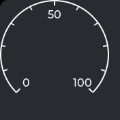 | 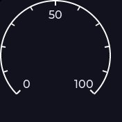 | 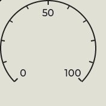 |
| `default/large/round-inner` | 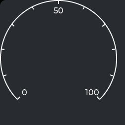 | 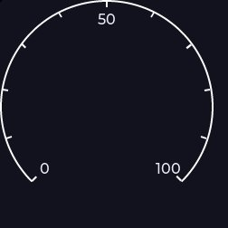 | 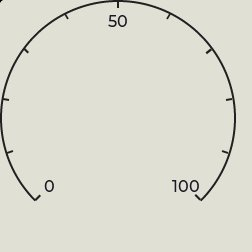 |
| `default/medium/sections` | 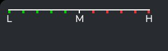 | 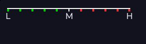 | 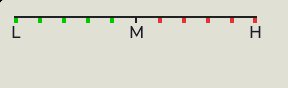 |

## Committed states

The asgard theme commits to rendering each state below **visually distinct** from `default` (gate-held: distinctness). Any state *not* listed renders identical to `default` (inertness — hovered-on-a-label is the canonical probe).

- `default`

## Props schema — `ScaleProps` (`ui.ScaleProps`)

| field | number | type | constraints |
|---|---|---|---|
| mode | 1 | enum ui.ScaleMode | enum.definedOnly=true |
| total_tick_count | 2 | uint32 | — |
| major_tick_every | 3 | uint32 | — |
| label_show | 4 | bool | — |
| min_value | 5 | int32 | — |
| max_value | 6 | int32 | — |
| rotation | 7 | int32 | — |
| angle_range | 8 | uint32 | uint32.lte=360 |
| text_src | 9 | string | string.maxLen=255 |
| post_draw | 10 | bool | — |
| sections | 11 | repeated message ui.ScaleSection | repeated.maxItems=4 |

*Shape-only: the committed JSON descriptor carries no `SourceCodeInfo` comments and `docs/.protodoc/proto-db.edn` does not cover the `ui` package, so no per-field prose exists to include (protogen backlog).*

## Known limitations

Non-interactive display widget: default state only (stock adds no state style for lv_scale; a disabled cell would be a duplicate — add one only when a theme styles it). The mode axis (horizontal/vertical/round-outer/round-inner) is the behavioral axis. Linear + sections cells nest in a padded wrapper (pad-all 16, border-width 0 — the slider-wrapper idiom): end-tick labels center on the edge ticks and draw OUTSIDE the widget box via ext-draw, so at the harness origin the leading '0' (horizontal/sections' left label) and the top '100' (vertical) clipped at the canvas edge; measured overhang <= 12px (half the widest end label), 16px pad covers it with AA headroom. round-outer cells add a TOP-BIASED standoff on top of that pad (subject :y inside a taller wrapper) for the mid-tick label's ~31px top overhang — see the round-outer card notes. round-inner deliberately carries NO :angle_range override: at 360 the min and max labels land on the SAME angle and overprint ('0' atop '100'); the LVGL default 270 keeps them apart (round-outer parity).

---
Cross-links: [`ui_ast.proto`](../../../proto/ui/ui_ast.proto) &middot; [protodoc index](../../index.md) &middot; [widget gallery index](../README.md)
