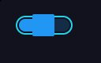
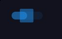
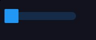

<!--
GENERATED by the devcards gallery generator — DO NOT EDIT.
Regenerate: `clojure -M:bindings:run gallery` from the devcards tool root
(tools/devcards/). Sources: corpus/spec.edn (cards + notes) +
conventions/ui-render-conventions.edn (:widget-states, :state-selectors) +
output/json-descriptors/descriptor-set.json (props schema) + the colocated
per-card JPEGs rendered from the pinned controls.wasm.
-->

# WIDGET_SLIDER

`lv_slider` — 18 atomic corpus cards (state × size[/value], ids `lv_slider/<state>/<size>[/<value>]`), rendered unstyled so everything unset falls through to the loaded theme — the object under test. One image per card × family, cropped to the card's dump_tree content box; the row caption is the card-id tail.

## States

| state | vanilla (family 1, dark) | asgard dark (family 0) | asgard light (family 0) |
|---|---|---|---|
| `default/small/mid` |  |  |  |
| `default/medium/mid` |  |  |  |
| `default/large/mid` |  |  |  |
| `pressed/small/mid` |  |  |  |
| `pressed/medium/mid` |  |  |  |
| `pressed/large/mid` |  |  |  |
| `focus-key/small/mid` |  |  |  |
| `focus-key/medium/mid` |  |  |  |
| `focus-key/large/mid` |  |  |  |
| `disabled/small/mid` |  |  |  |
| `disabled/medium/mid` |  |  |  |
| `disabled/large/mid` |  |  |  |
| `edited/medium/mid` |  |  |  |
| `hovered/medium/mid` |  |  |  |
| `default/medium/min` |  |  |  |
| `default/medium/max` |  |  |  |
| `pressed/medium/min` |  |  |  |
| `pressed/medium/max` |  |  |  |

## Committed states

The asgard theme commits to rendering each state below **visually distinct** from `default` (gate-held: distinctness). Any state *not* listed renders identical to `default` (inertness — hovered-on-a-label is the canonical probe).

- `default`
- `hovered`
- `pressed`
- `disabled`
- `focus-key`
- `edited`

## Props schema — `SliderProps` (`ui.SliderProps`)

| field | number | type | constraints |
|---|---|---|---|
| min_value | 1 | int32 | — |
| max_value | 2 | int32 | — |
| value | 3 | int32 | — |
| mode | 4 | enum ui.BarMode | enum.definedOnly=true |
| seek_on_press | 5 | bool | — |

*Shape-only: the committed JSON descriptor carries no `SourceCodeInfo` comments and `docs/.protodoc/proto-db.edn` does not cover the `ui` package, so no per-field prose exists to include (protogen backlog).*

## Known limitations

checked is N/A (no CHECKED wiring for WIDGET_SLIDER in stock or renderer). edited is encoder-only (touch-unreachable) — collapsed to one size per survey. Every cell nests in a padded wrapper card for knob/outline bleed.

---
Cross-links: [`ui_ast.proto`](../../../proto/ui/ui_ast.proto) &middot; [protodoc index](../../index.md) &middot; [widget gallery index](../README.md)
