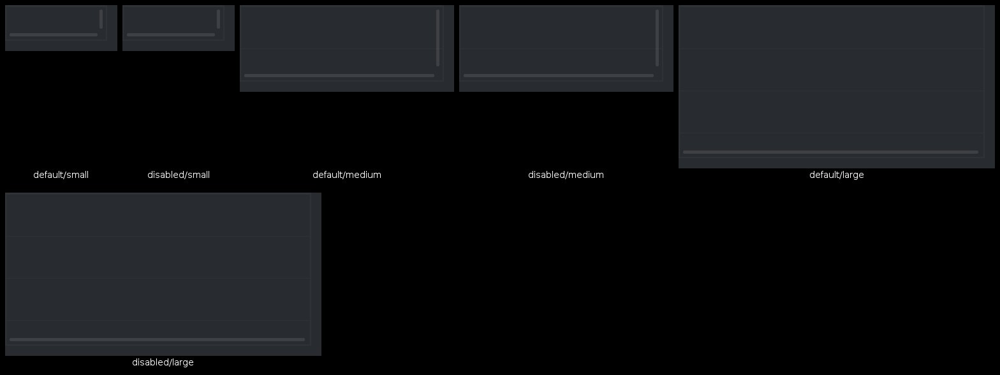
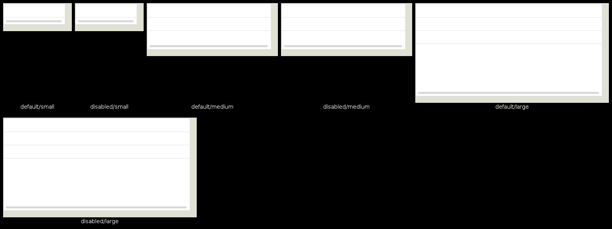

<!--
GENERATED by the devcards gallery generator — DO NOT EDIT.
Regenerate: `clojure -M:bindings:run gallery` from the devcards tool root
(tools/devcards/). Sources: corpus/spec.edn (cards + notes) +
conventions/ui-render-conventions.edn (:widget-states, :state-selectors) +
output/json-descriptors/descriptor-set.json (props schema) + the colocated
contact-sheet JPEGs rendered from the pinned controls.wasm.
-->

# WIDGET_TABLE

`lv_table` — 6 atomic corpus cards (state × size[/value], ids `lv_table/<state>/<size>[/<value>]`), rendered unstyled so everything unset falls through to the loaded theme — the object under test. Cell labels are the card-id tails; cells are cropped to the card's dump_tree content box.

## Contact sheets

### vanilla (family 1, dark)

### asgard dark (family 0)

### asgard light (family 0)

## Committed states

The asgard theme commits to rendering each state below **visually distinct** from `default` (gate-held: distinctness). Any state *not* listed renders identical to `default` (inertness — hovered-on-a-label is the canonical probe).

- `default`

## Props schema — `TableProps` (`ui.TableProps`)

| field | number | type | constraints |
|---|---|---|---|
| row_count | 1 | uint32 | — |
| column_count | 2 | uint32 | — |

*Shape-only: the committed JSON descriptor carries no `SourceCodeInfo` comments and `docs/.protodoc/proto-db.edn` does not cover the `ui` package, so no per-field prose exists to include (protogen backlog).*

## Known limitations

KNOWN RENDERER DECODE GAP (renderer-side, backlogged — recorded, not resolved here): cell TEXT is unwired — renderer.c never sets cell_data (table_props decodes row/column counts only), so EVERY CELL RENDERS EMPTY in the gallery sheets; that is the renderer gap, not a theme or fixture defect. This gallery therefore judges grid geometry, not glyph clipping; the cell-text gap is recorded follow-on scope. pressed/focus-key/edited omitted: cell highlighting is gated on a real click (row_act/col_act), unreachable from a static fixture — a faked cell would render identical to default and assert nothing. Disabled cells are inertness parity pins.

---
Cross-links: [`ui_ast.proto`](../../../proto/ui/ui_ast.proto) &middot; [protodoc index](../../index.md) &middot; [widget gallery index](../README.md)
