<!--
GENERATED by the devcards gallery generator — DO NOT EDIT.
Regenerate: `clojure -M:bindings:run gallery` from the devcards tool root
(tools/devcards/). Sources: corpus/spec.edn (cards + notes) +
conventions/ui-render-conventions.edn (:widget-states, :state-selectors) +
output/json-descriptors/descriptor-set.json (props schema) + the colocated
per-card JPEGs rendered from the pinned controls.wasm.
-->

# WIDGET_TABVIEW

`lv_tabview` — 5 atomic corpus cards (state × size[/value], ids `lv_tabview/<state>/<size>[/<value>]`), rendered unstyled so everything unset falls through to the loaded theme — the object under test. One image per card × family, cropped to the card's dump_tree content box; the row caption is the card-id tail.

## States

| state | vanilla (family 1, dark) | asgard dark (family 0) | asgard light (family 0) |
|---|---|---|---|
| `default/small` | 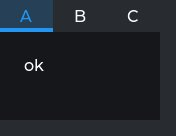 | 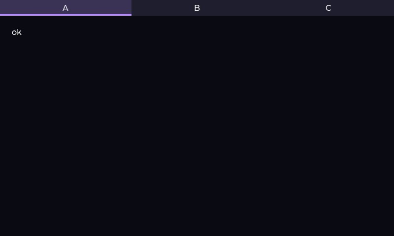 | 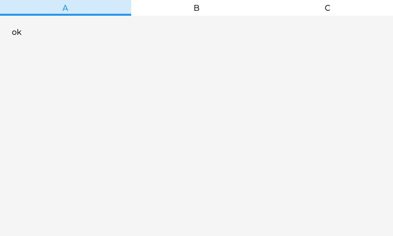 |
| `default/medium` |  | 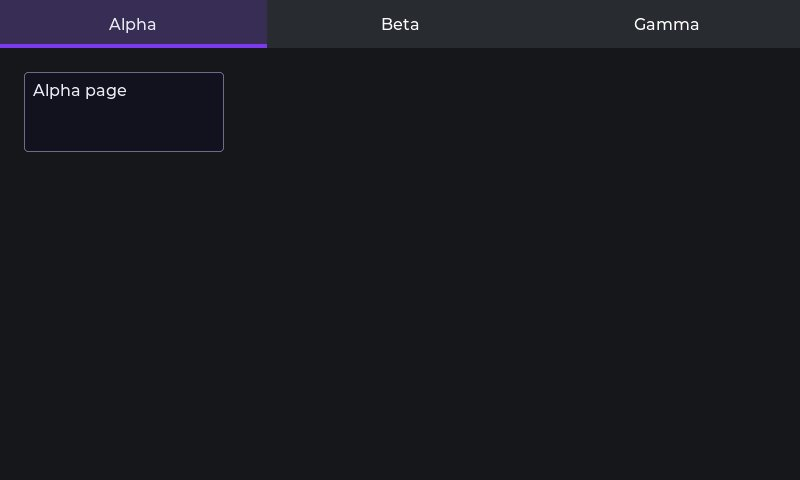 | 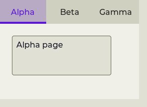 |
| `default/large` | 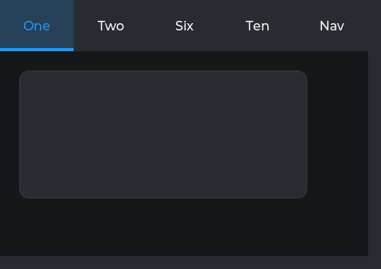 | 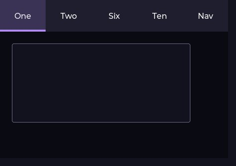 | 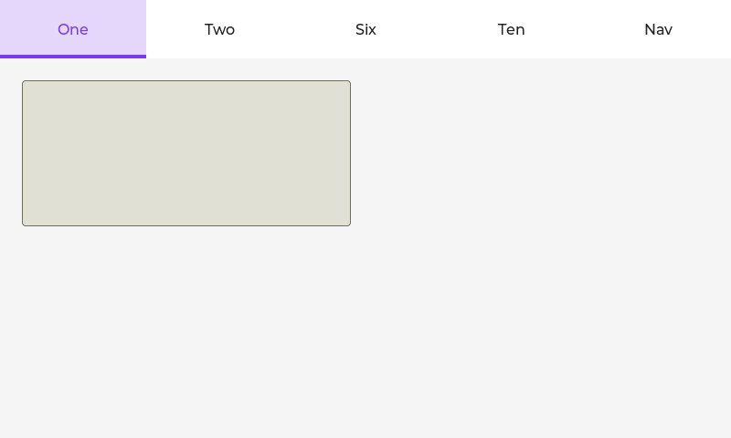 |
| `default/medium/active-last` | 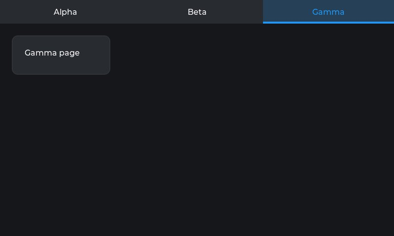 | 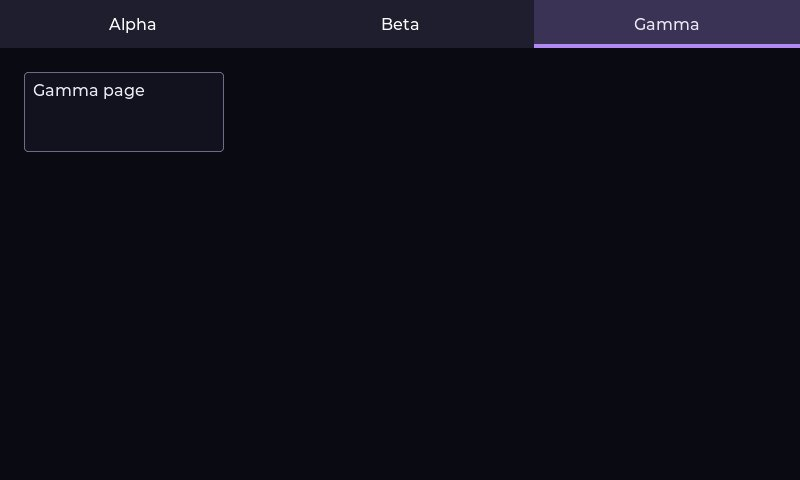 | 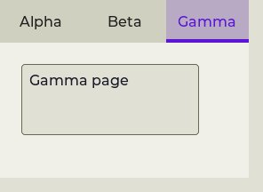 |
| `disabled/medium` | 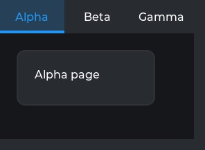 | 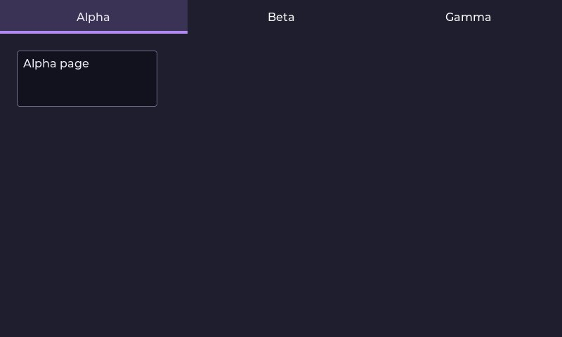 | 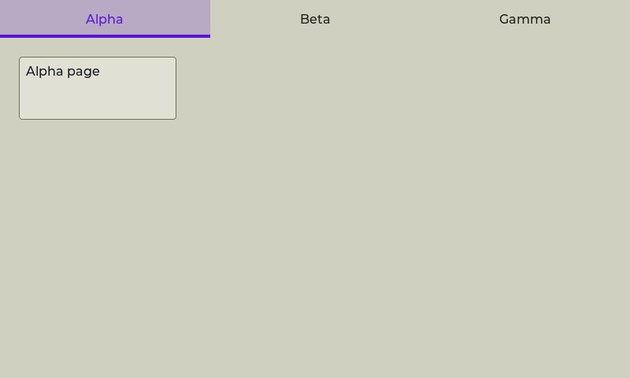 |

## Committed states

The asgard theme commits to rendering each state below **visually distinct** from `default` (gate-held: distinctness). Any state *not* listed renders identical to `default` (inertness — hovered-on-a-label is the canonical probe).

- `default`

## Props schema — `TabviewProps` (`ui.TabviewProps`)

| field | number | type | constraints |
|---|---|---|---|
| tab_names | 1 | repeated string | repeated.maxItems=8, repeated.items.string.maxLen=31 |
| tab_bar_size | 2 | int32 | — |
| active_index | 3 | uint32 | — |
| tab_bar_position | 4 | enum ui.Dir | enum.definedOnly=true |
| tab_bar_pad_left | 5 | int32 | — |

*Shape-only: the committed JSON descriptor carries no `SourceCodeInfo` comments and `docs/.protodoc/proto-db.edn` does not cover the `ui` package, so no per-field prose exists to include (protogen backlog).*

## Known limitations

Not a full size x state product (chrome location/color is size-independent): 3 size cells + 2 state cells at medium, per survey. pressed/focus-key on tab buttons are NOT wire-reachable (buttons are synthesized internally by lv_tabview_add_tab, never WidgetNodes) — omitted rather than faked. Page-content wrappers are fixed-px unstyled objs (the survey's pct-100 surface-1 cards translated: LV_PCT encoding is outside the raw-prop vocabulary, and surface tokens are banned). KNOWN WIRE GAP (recorded, not resolved here): PROP_WIDTH/PROP_HEIGHT on a WIDGET_TABVIEW are silently defeated — lv_tabview_constructor calls lv_obj_set_size(pct100,pct100), a LOCAL style that outranks the renderer's added style-group styles — so every cell below renders full-canvas regardless of its authored w/h (verified: wire bytes carry 280x200, dump shows 798x478). The authored sizes are kept as the intent; they start binding when the renderer's tabview arm routes w/h through lv_obj_set_size.

---
Cross-links: [`ui_ast.proto`](../../../../../proto/ui/ui_ast.proto) &middot; [protodoc index](../../../../../docs/index.md) &middot; [widget gallery index](../README.md)
