<!--
GENERATED by the devcards gallery generator — DO NOT EDIT.
Regenerate: `clojure -M:bindings:run gallery` from the devcards tool root
(tools/devcards/). Sources: corpus/spec.edn (cards + notes) +
conventions/ui-render-conventions.edn (:widget-states, :state-selectors) +
output/json-descriptors/descriptor-set.json (props schema) + the colocated
per-card JPEGs rendered from the pinned controls.wasm.
-->

# WIDGET_TARGET_OVERLAY

`lv_target_overlay` — 9 atomic corpus cards (state × size[/value], ids `lv_target_overlay/<state>/<size>[/<value>]`), rendered unstyled so everything unset falls through to the loaded theme — the object under test. One image per card × family, cropped to the card's dump_tree content box; the row caption is the card-id tail.

## States

| state | vanilla (family 1, dark) | asgard dark (family 0) | asgard light (family 0) |
|---|---|---|---|
| `default/small` | 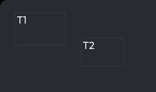 | 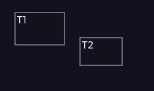 | 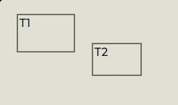 |
| `default/medium` | 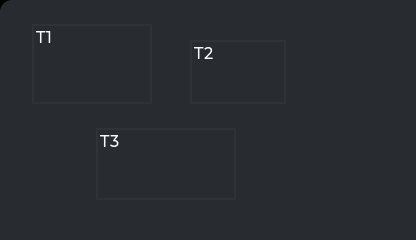 | 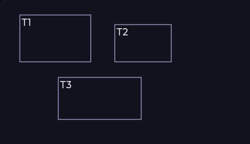 | 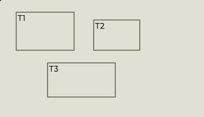 |
| `default/large` | 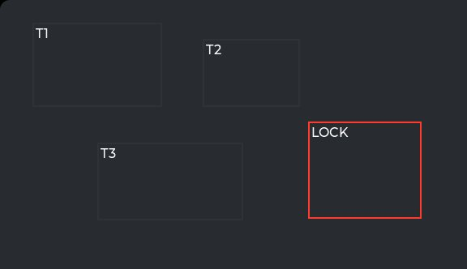 | 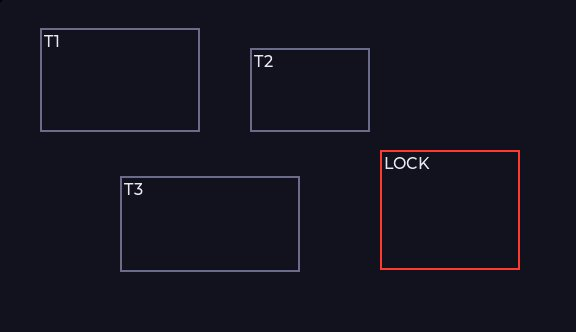 | 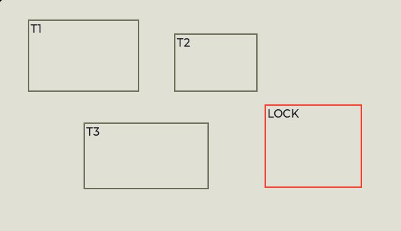 |
| `default/medium/hidden-labels` | 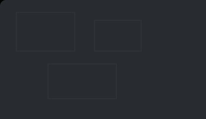 | 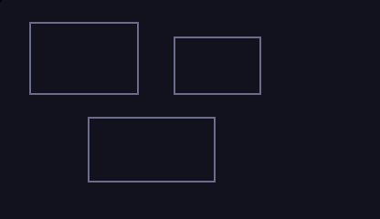 | 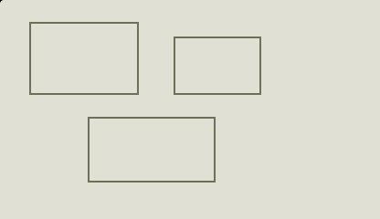 |
| `default/medium/thick` | 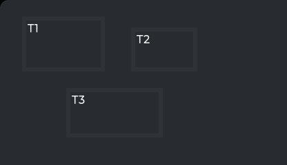 | 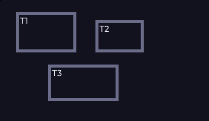 | 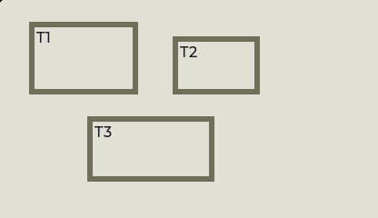 |
| `default/medium/tinted` | 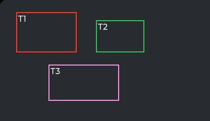 | 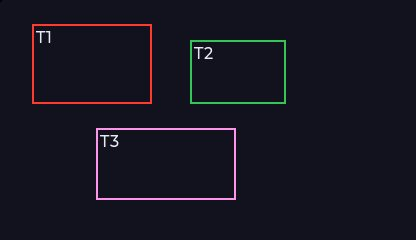 | 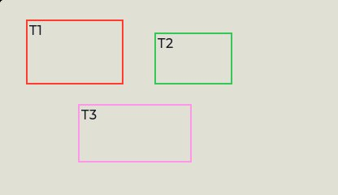 |
| `default/medium/authored` | 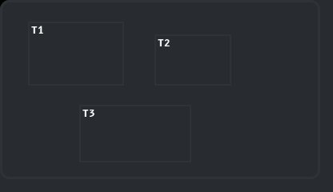 | 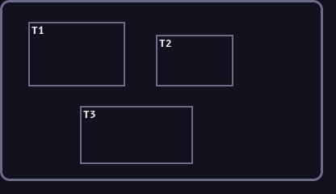 | 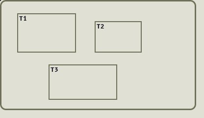 |
| `default/medium/empty` |  |  | 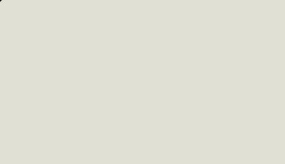 |
| `default/medium/overlapping` | 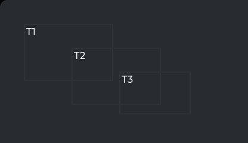 | 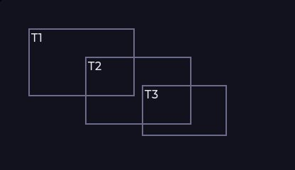 | 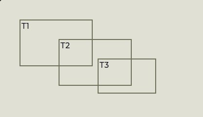 |

## Committed states

The asgard theme commits to rendering each state below **visually distinct** from `default` (gate-held: distinctness). Any state *not* listed renders identical to `default` (inertness — hovered-on-a-label is the canonical probe).

- `default`

## Props schema — `TargetOverlayProps` (`ui.TargetOverlayProps`)

| field | number | type | constraints |
|---|---|---|---|
| boxes | 1 | repeated message ui.TargetBox | repeated.maxItems=32 |
| border_width | 2 | uint32 | uint32.lte=16 |
| hide_labels | 3 | bool | — |

*Shape-only: the committed JSON descriptor carries no `SourceCodeInfo` comments and `docs/.protodoc/proto-db.edn` does not cover the `ui` package, so no per-field prose exists to include (protogen backlog).*

## Known limitations

No LVGL state axis: the overlay is DECORATIVE and pointer-transparent by construction (CLICKABLE and SCROLLABLE cleared at create on the overlay, on every box and on every caption), so no state can ever be entered and every non-default state is inert by the widget's own contract rather than by the theme's. Boxes carry design-pixel rects against the overlay's content origin — the WidgetNode.x/y unit — and are FLOATING + IGNORE_LAYOUT so an authored layout on the overlay cannot move them. Captions sit on a COVERING plate in the overlay's own resolved bg color; without it every caption would declare backdrop_unresolved, which is the honest answer for glyphs over content the renderer cannot see and is not one to ship on every card.

---
Cross-links: [`ui_ast.proto`](../../../../../proto/ui/ui_ast.proto) &middot; [protodoc index](../../../../../docs/index.md) &middot; [widget gallery index](../README.md)
