<!--
GENERATED by the devcards gallery generator — DO NOT EDIT.
Regenerate: `clojure -M:bindings:run gallery` from the devcards tool root
(tools/devcards/). Sources: corpus/spec.edn (cards + notes) +
conventions/ui-render-conventions.edn (:widget-states, :state-selectors) +
output/json-descriptors/descriptor-set.json (props schema) + the colocated
per-card JPEGs rendered from the pinned controls.wasm.
-->

# Kitchen sinks

The 6 authored multi-widget compositions from the same corpus the gates verify — the only cells where widgets render as neighbors. Each is a whole composite screen, cropped to the sink container: one image per sink × family.

## Screens

| state | vanilla (family 1, dark) | asgard dark (family 0) | asgard light (family 0) |
|---|---|---|---|
| `form-row` |  | 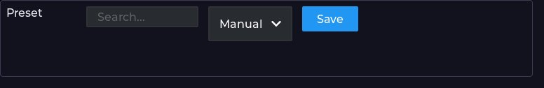 | 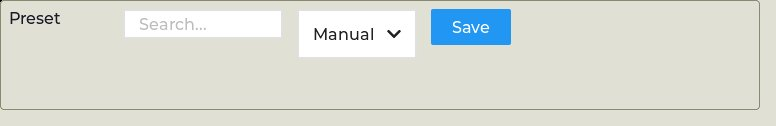 |
| `toolbar-strip` |  | 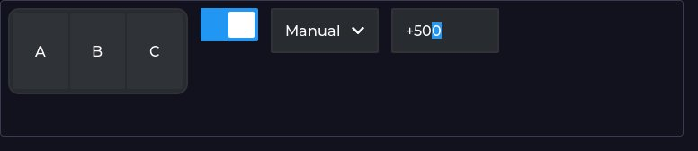 | 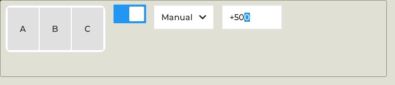 |
| `gauge-cluster` | 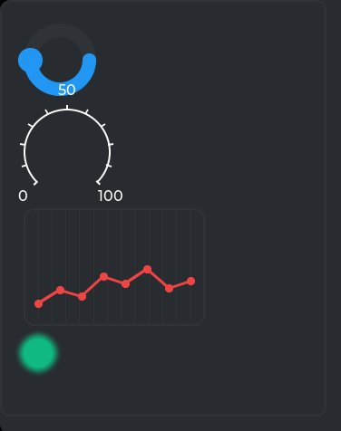 | 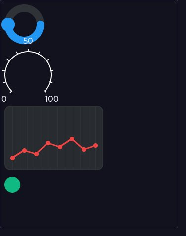 | 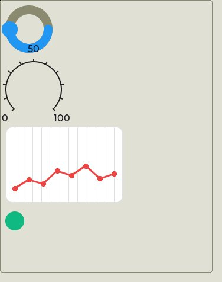 |
| `settings-panel` | 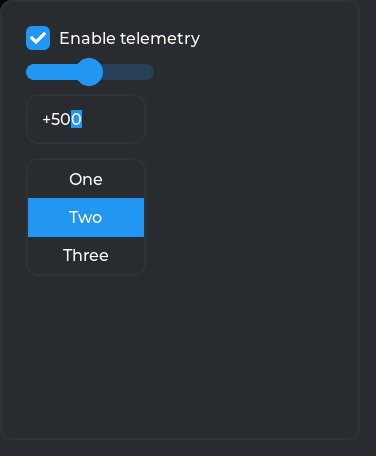 | 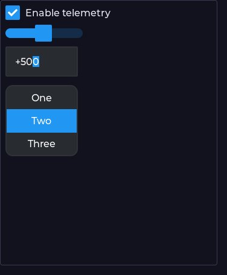 | 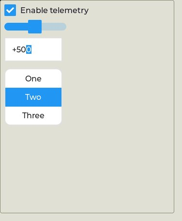 |
| `hud-overlay` | 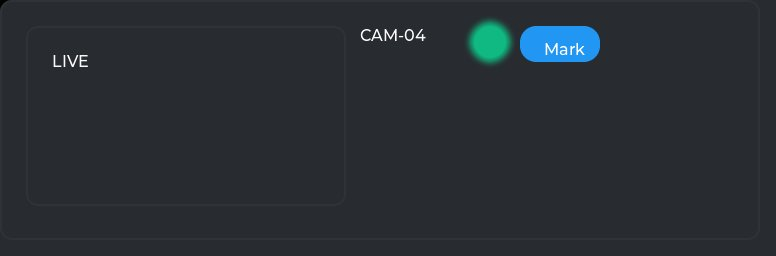 | 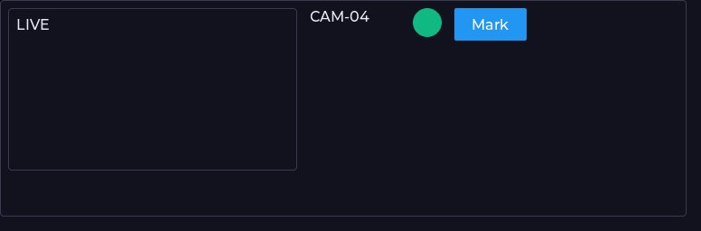 | 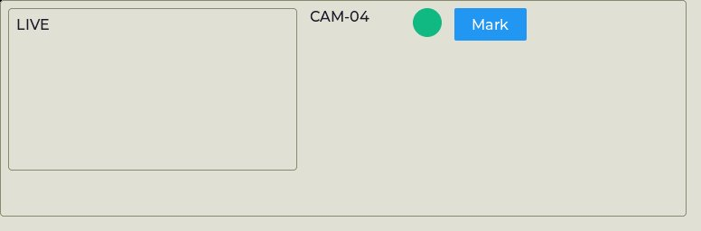 |
| `tabview-with-content` | 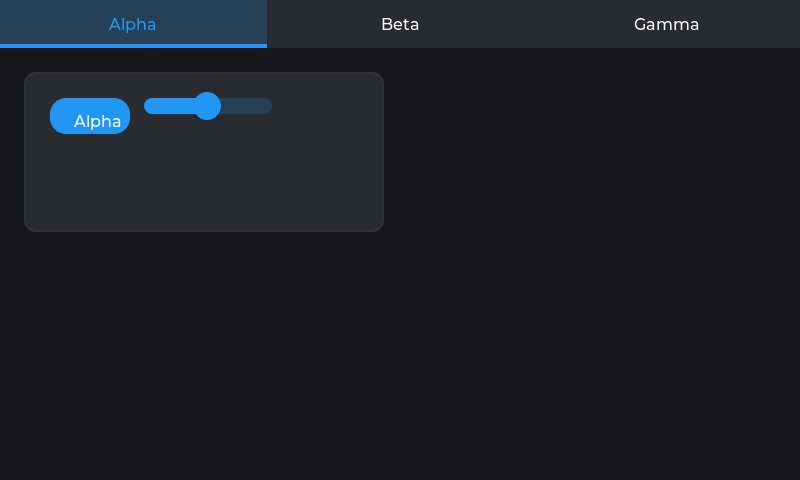 | 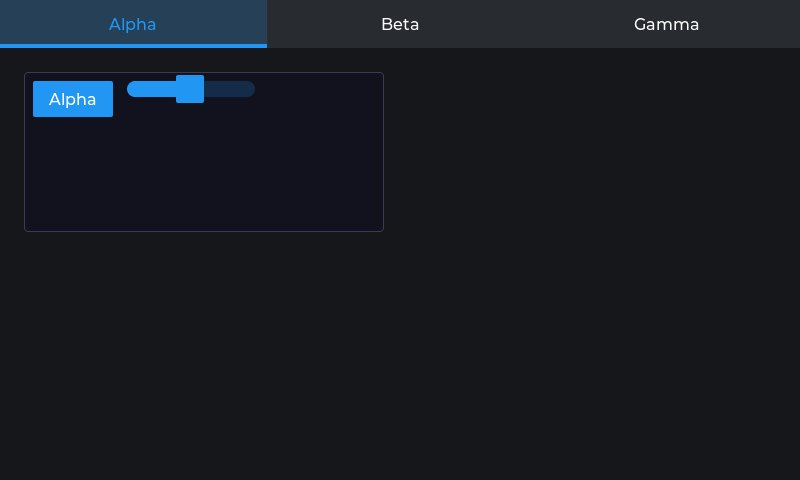 | 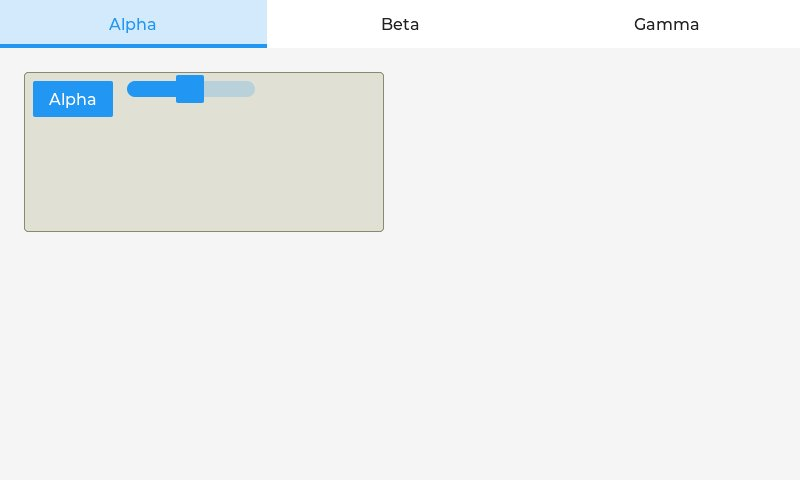 |

## The compositions

| sink | member widgets | what it proves |
|---|---|---|
| `kitchen-sink/form-row` | [WIDGET_LABEL](../WIDGET_LABEL/README.md), [WIDGET_TEXTAREA](../WIDGET_TEXTAREA/README.md), [WIDGET_DROPDOWN](../WIDGET_DROPDOWN/README.md), [WIDGET_BUTTON](../WIDGET_BUTTON/README.md) | label + textarea + dropdown + button in one flex row at each form-control size — proves the radius fork (2px controls vs 4px panels) reads as one family and that adjacent focus-key rings don't overlap. |
| `kitchen-sink/toolbar-strip` | [WIDGET_BUTTONMATRIX](../WIDGET_BUTTONMATRIX/README.md), [WIDGET_SWITCH](../WIDGET_SWITCH/README.md), [WIDGET_DROPDOWN](../WIDGET_DROPDOWN/README.md), [WIDGET_SPINBOX](../WIDGET_SPINBOX/README.md) | buttonmatrix + switch + dropdown + spinbox in a full-width row at zoom_controls.edn scale — the real production shape most likely to expose the buttonmatrix pad fix against tight siblings. |
| `kitchen-sink/gauge-cluster` | [WIDGET_ARC](../WIDGET_ARC/README.md), [WIDGET_SCALE](../WIDGET_SCALE/README.md), [WIDGET_CHART](../WIDGET_CHART/README.md), [WIDGET_LED](../WIDGET_LED/README.md) | arc + scale(round-outer) + chart(line) + led stacked in one card — validates :accent-bg/:focused-edge/:edge-0 read coherently across four different LVGL draw primitives at once. |
| `kitchen-sink/settings-panel` | [WIDGET_OBJ](../WIDGET_OBJ/README.md), [WIDGET_CHECKBOX](../WIDGET_CHECKBOX/README.md), [WIDGET_SLIDER](../WIDGET_SLIDER/README.md), [WIDGET_SPINBOX](../WIDGET_SPINBOX/README.md), [WIDGET_ROLLER](../WIDGET_ROLLER/README.md) | card containing checkbox + slider + spinbox + roller in a flex-col, mirroring kitchen_sink.edn's real shape — proves the 2px control radius nested inside the 4px card radius doesn't look mismatched. |
| `kitchen-sink/hud-overlay` | [WIDGET_HOST_PROXY](../WIDGET_HOST_PROXY/README.md), [WIDGET_LABEL](../WIDGET_LABEL/README.md), [WIDGET_LED](../WIDGET_LED/README.md), [WIDGET_BUTTON](../WIDGET_BUTTON/README.md) | host_proxy + label + led + button at host_proxy_demo.edn's pip-video size — the direct regression test for the lv_obj(8px default)/host_proxy(0px local override) fork resolution in one screen. |
| `kitchen-sink/tabview-with-content` | [WIDGET_TABVIEW](../WIDGET_TABVIEW/README.md), [WIDGET_OBJ](../WIDGET_OBJ/README.md), [WIDGET_BUTTON](../WIDGET_BUTTON/README.md), [WIDGET_SLIDER](../WIDGET_SLIDER/README.md) | tabview wrapping a card+button+slider per page — proves the frozen pad_normal=24 page-grid constant survives untouched while the tab-bar's accent-bg/focused-edge overrides render correctly. |

---
Cross-links: [widget gallery index](../README.md)
