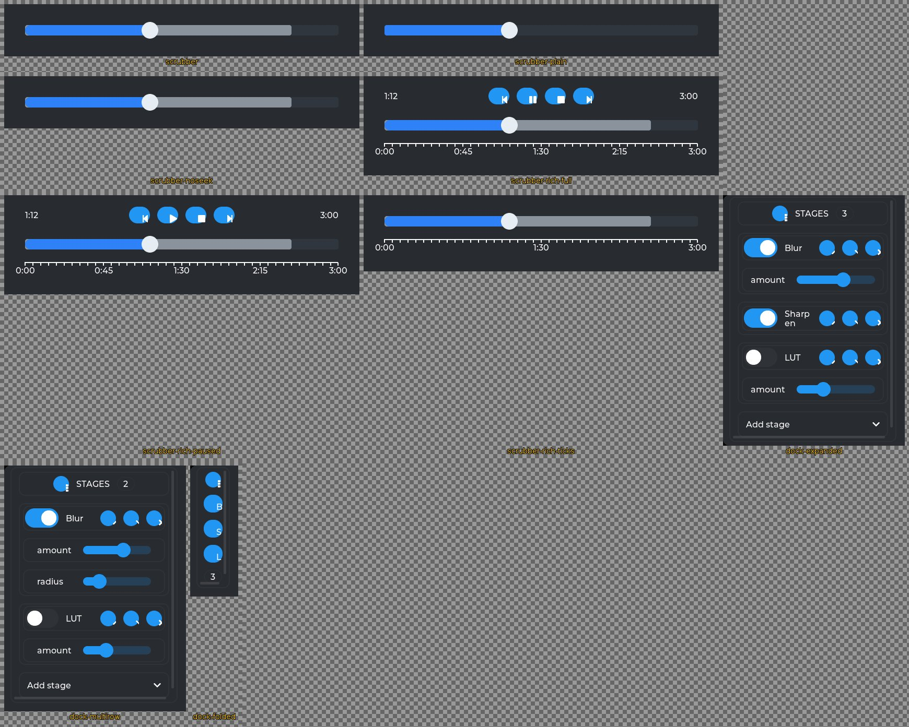
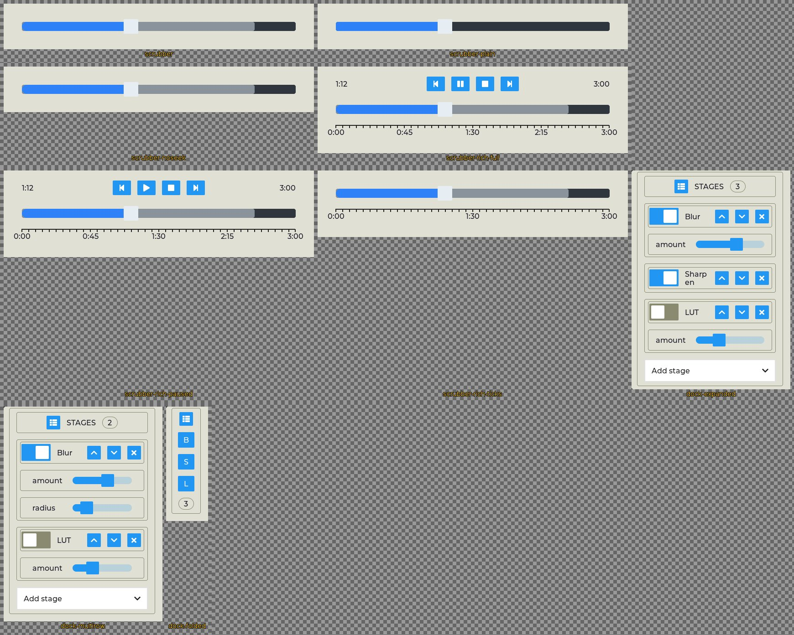

<!--
GENERATED by the devcards gallery generator — DO NOT EDIT.
Regenerate: `clojure -M:bindings:run gallery` from the devcards tool root
(tools/devcards/). Sources: corpus/spec.edn (cards + notes) +
conventions/ui-render-conventions.edn (:widget-states, :state-selectors) +
output/json-descriptors/descriptor-set.json (props schema) + the colocated
contact-sheet JPEGs rendered from the pinned controls.wasm.
-->

# Composition legos

The 9 authored-composition cards from `corpus/composition.edn` — the public `devcards.legos` builders compiled through the authored lane (`devcards.fixtures/build-authored-card`), the only corpus cells carrying events, absolute placement, and part-selector styling. Interaction contracts (press-seek, drag, the ext-click halo, dock event identities) are gate-held on BOTH engines; the sheets document the pixels. Cells are cropped to the lego's own box — the scrubber's includes its transparent hit-halo wrapper.

## Contact sheets

### vanilla (family 1, dark)

### asgard dark (family 0)

### asgard light (family 0)

## The cards

| card | lego | what it proves |
|---|---|---|
| `lego/scrubber` | `scrubber` | Buffered media scrubber: bar underlay (track + buffered band) beneath a transparent-MAIN slider overlay (played band + knob). seek_on_press rides the lego contract; interaction probes assert press-seek [value] with NO duplicate at release, drag prepends exactly one immediate value, and the 24px ext-click envelope (both engines). |
| `lego/scrubber-plain` | `scrubber` | No :buffered — a single styled slider (MAIN is the track); no bar underlay in the DOM. |
| `lego/scrubber-noseek` | `scrubber` | seek_on_press pixel-inertness pin: raw FB must equal lego/scrubber byte-for-byte in both dark and light — the corpus-level restatement of the prop-absent parity proof (the prop changes hit behavior only, never pixels), held per re-mint. |
| `lego/scrubber-rich-full` | `scrubber-rich` | Every optional part enabled: transport row FLANKED by the elapsed/total readout, the plain scrubber embedded unchanged (halo + press-seek intact), and a labelled tick ruler. Major-tick texts ride ScaleProps.text_src, so the timecode ruler needs no vocabulary beyond WIDGET_SCALE. :playing? true, so the one play/pause button shows the PAUSE glyph. |
| `lego/scrubber-rich-paused` | `scrubber-rich` | The :playing? twin of lego/scrubber-rich-full — identical in every other option, so the ONLY difference between the two renders is the play/pause button's glyph. That is the whole claim of the single stateful transport control: one button, one event identity (tp-play-pause), two icons. |
| `lego/scrubber-rich-ticks` | `scrubber-rich` | Ticks + labels only — no transport, no readout. The additive floor: the same lego with one optional key set is a timecode ruler and nothing more. |
| `lego/dock-expanded` | `dock-panel` | The three-caption-state floor (enabled+expanded / enabled+collapsed / disabled+expanded). Interaction probes assert the event identities <stage-id>-up/-down/-delete/-toggle (int_value = stage index) and dock-fold. |
| `lego/dock-multirow` | `dock-panel` | Multiple body ROWS per stage container. :body-nodes accepts a vector of vectors — one row each — and the card's height is DERIVED from the row count, so a two-row stage grows its container instead of being clipped by a fixed :card-expanded-h. Row content is centred on both axes, so a short row reads as centred in the card rather than pinned to the top-left. |
| `lego/dock-folded` | `dock-panel` | The folded icon rail (fold toggle + per-stage letter buttons + badge); only dock-fold is a live identity — rail taps are consumer-side by the ratified shape. |

---
Cross-links: [widget gallery index](../README.md)
